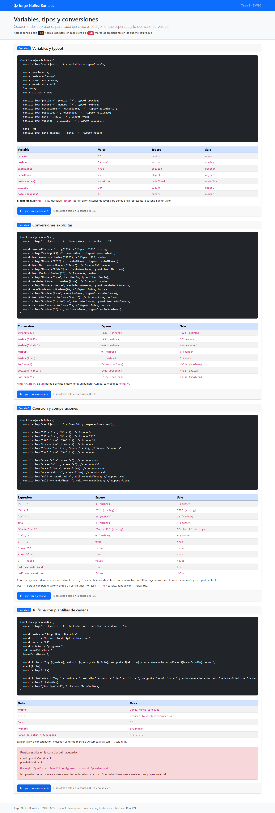
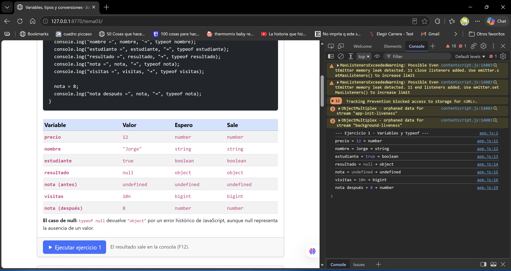
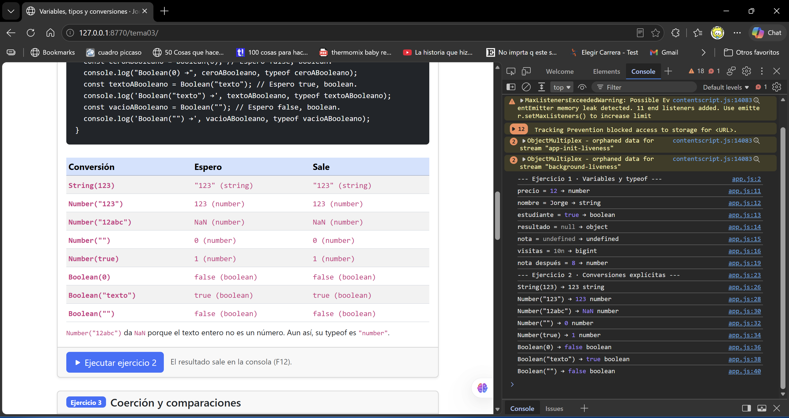
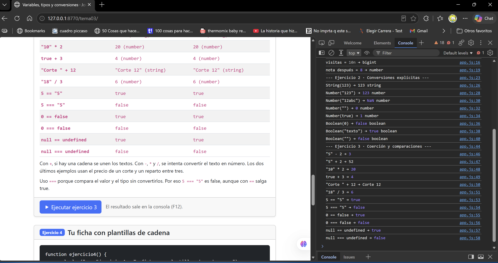
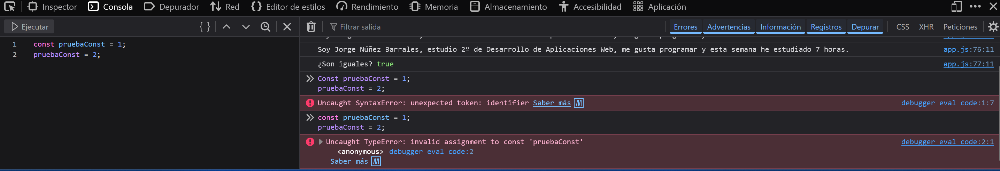

**Tema 3: variables, tipos y conversiones**

Jorge Núñez Barrales · 2º DAW

**En qué consiste la tarea**

La tarea consiste en probar cómo funcionan las variables y los tipos de datos en JavaScript. En el primer ejercicio se declaran variables de distintos tipos y se comprueban con typeof. En el segundo se convierten valores a número, texto y booleano para ver qué devuelve cada conversión.

En el tercero se mezclan tipos en operaciones y se compara lo que pasa al usar == y ===. En el último se prepara una ficha con los datos y se escribe el mismo mensaje de dos formas. También se prueba qué pasa al intentar cambiar una constante. Cada ejercicio tiene un botón para ejecutarlo y una tabla para comparar lo que se esperaba con lo que sale en la consola.

**Evidencias**

**1. Página completa**

Aquí se ven mi nombre y los cuatro ejercicios, cada uno con su código, tabla y botón.

**2. Variables y tipos**

La consola muestra el valor y el tipo de las variables. La variable nota empieza sin valor y después pasa a valer 8.

**3. Conversiones**

Se ven las ocho conversiones con Number, String y Boolean. En cada resultado aparece también su tipo.

**4. Coerción y comparaciones**

Aquí aparecen las operaciones que mezclan tipos y las diferencias entre comparar con == y con ===.

**5. Ficha y error de const**

Se ve la ficha y la comparación, que da true. Primero escribí Const con mayúscula y dio un error de sintaxis. Al corregirlo salió el error por intentar cambiar una constante.

**Reflexión**

Pasar de "123" a número o de 123 a texto es bastante directo.  
Lo menos evidente es que Number("") dé 0 aunque no haya ningún número escrito.  
Number("12abc") da NaN porque no puede convertir todo el texto.  
Boolean(0) y Boolean("") dan false, pero Boolean("texto") da true.  
Con "5" + 2 se juntan los valores y sale "52"; con "5" - 2 sale 3.  
Por eso conviene fijarse en los tipos y usar === para comparar sin conversiones.

**Fuentes consultadas**

- [Plantilla del profesor](https://github.com/DRodero/DWEC_2627/tree/main/tema03_plantilla)
- [typeof en MDN](https://developer.mozilla.org/es/docs/Web/JavaScript/Reference/Operators/typeof)
- [Number en MDN](https://developer.mozilla.org/es/docs/Web/JavaScript/Reference/Global_Objects/Number)
- [Igualdad estricta en MDN](https://developer.mozilla.org/es/docs/Web/JavaScript/Reference/Operators/Strict_equality)
- [Plantillas de cadena en MDN](https://developer.mozilla.org/es/docs/Web/JavaScript/Reference/Template_literals)

**Uso de IA**

He utilizado ChatGPT como apoyo para preparar el código, entender mejor algunas partes y agilizar un poco la tarea.
